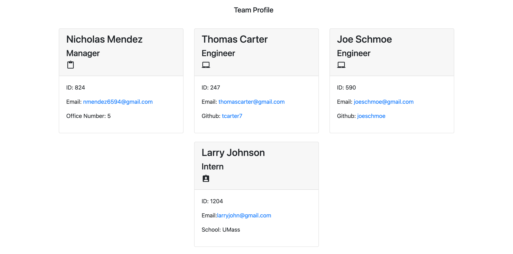

# Team Profile Generator


## Description
This application is used to form a team profile. In node, the script will be run and prompt the user to fill out certain roles for a team and then an HTML file will be output showing all of the information the user has entered
          
View the deployed page at [Team Profile Generator](nmendez4.github.io/team-profile-generator).
## Contents
* [Installation](#installation)
* [Usage](#usage)
   * [Screenshots](#screenshots)
* [Built With](#built-with)
* [Contributing](#contributing)
* [Tests](#tests)
* [Questions](#questions)
* [Credits](#credits)

## Installation
To use this application, please install: 
```
In order to run this application please install: VS Code, node, and inquirer, and also have a browser to open the application into (preferred google chrome)
```
  
## Usage
In order to use this application please have VS code, node and inquirer installed. You may then download the application from my GitHub repo. After downloading each of the above, you may run the application using node index, then fill out the required areas prompted by the script. 
  
### Screenshots

This is an HTML example of the output after running the script
![Video Overview Link]
https://drive.google.com/file/d/1XIcrVL2viJRmIOjEC11aOrzFU8EM5VnB/view

## Built With

* HTML
* CSS
* JavaScript
* Node.js
  
## Contributing
Contributions provided by Nicholas Mendez and UConn Coding Bootcamp
  
## Tests
To run tests on the application, install
```
To test this application please run node index from the integrated terminal and answer the prompts accordingly
```
and run `npm run test` from the command line.
  
## Questions
If you have any questions about the repo, please [open an issue](https://github.com/nmendez4/https://github.com/nmendez4/team-profile-generator/issues) or contact me via email at nmendez6594@gmail.com. You can find more of my work on my GitHub, [nmendez4](https://github.com/nmendez4/).
  
## Issues
* [Issues](https://github.com/nmendez4/https://github.com/nmendez4/team-profile-generator/issues) 

* [Issues](https://github.com/nmendez4/https://github.com/nmendez4/team-profile-generator/graphs/contributors) 

  
